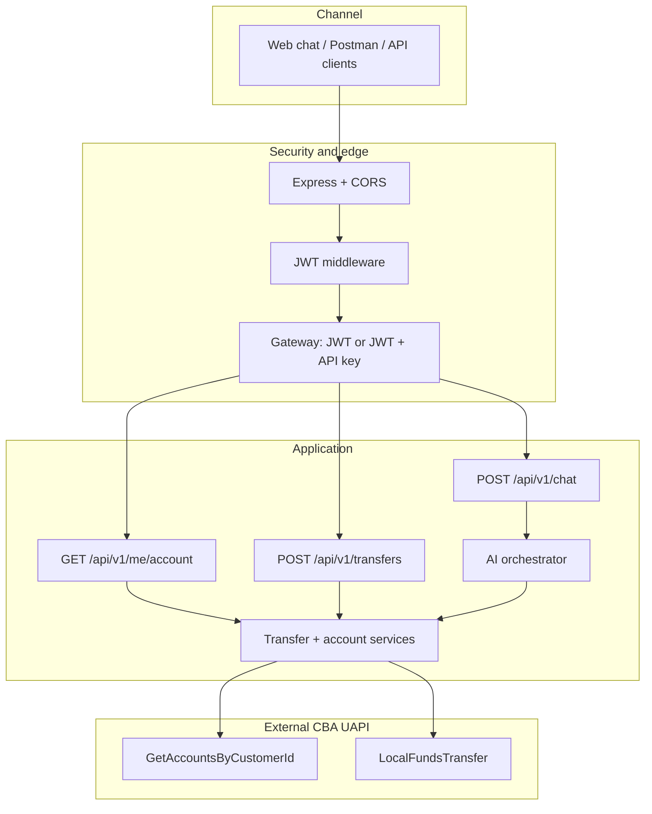
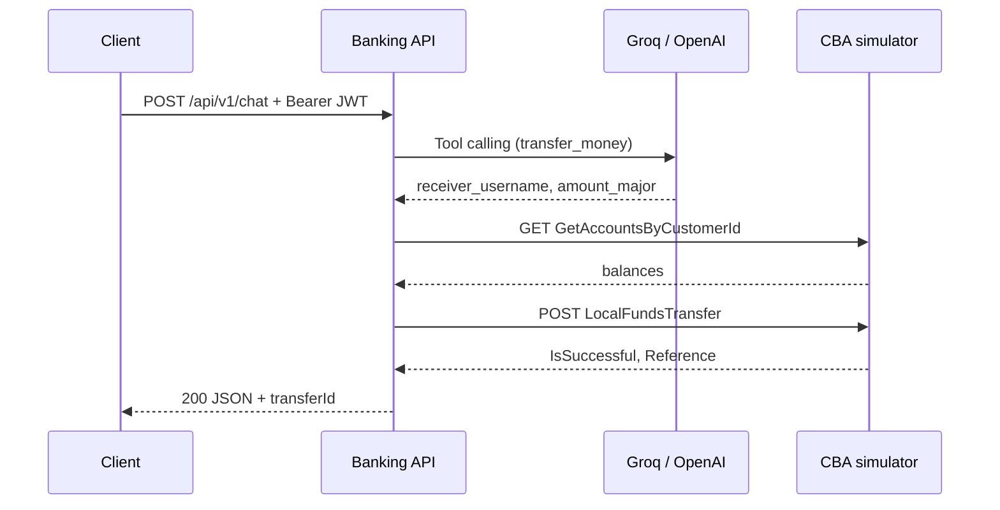

# AI Banking API — Backend Integration Handbook

**Stack:** Node.js 18+, Express, JWT, Groq/OpenAI (function calling), CBA UAPI simulator.

**PDF export:** open `banking-api-handbook.html` in a browser → Print → **Save as PDF**.

---

## 1. Overview

- **Auth:** Bearer JWT on `/api/v1/*` (demo issuer: `POST /auth/token`). JWT includes `customerId` and `accountNumber` (NUBAN) for CBA.
- **Gateway:** `DEFAULT_GATEWAY_ENABLED=true` → JWT only. `false` → also require `X-API-Key` (`GENERAL_API_KEY`).
- **AI:** Groq (default) → OpenAI (fallback) → regex rules if no keys.
- **Banking:** Real HTTP calls to CBA mock server — `GetAccountsByCustomerId`, `LocalFundsTransfer`.
- **Payees:** Chat username → NUBAN via `CBA_PAYEE_ACCOUNT_MAP` (JSON env).

---

## 2. Architecture (Mermaid)

### 2.1 Layers

### 2.2 Chat transfer sequence

---

## 3. Source layout

| File | Role |
|------|------|
| `src/server.js` | App bootstrap, routes |
| `src/config.js` | Environment config |
| `src/middleware/jwtAuth.js` | `req.auth`, `req.accessToken` |
| `src/middleware/gatewayAuth.js` | Default vs general gateway |
| `src/routes/auth.js` | `POST /auth/token` |
| `src/routes/chat.js` | `POST /api/v1/chat` |
| `src/routes/accounts.js` | `GET /api/v1/me/account` |
| `src/routes/transfers.js` | `POST /api/v1/transfers` |
| `src/services/llmOrchestrator.js` | Groq → OpenAI |
| `src/services/ruleBasedOrchestrator.js` | Regex NLU |
| `src/services/aiOrchestrator.js` | Combines LLM + rules |
| `src/cba/cbaClient.js` | HTTP to CBA |
| `src/cba/cbaBankingRepository.js` | Account + transfer logic |
| `src/data/cbaUsers.js` | Demo logins + CBA ids |

---

## 4. Environment variables

See `.env.example` in the repo root. Critical entries:

- `CBA_BASE_URL`, `CBA_AUTH_TOKEN`, `CBA_PAYEE_ACCOUNT_MAP`
- `GROQ_API_KEY`, `OPENAI_API_KEY` (optional)
- `JWT_SECRET`, `PORT`, gateway flags

---

## 5. HTTP API

| Method | Path | Auth |
|--------|------|------|
| GET | `/health` | None |
| POST | `/auth/token` | None — body `username`, `password` |
| POST | `/api/v1/chat` | Bearer JWT |
| GET | `/api/v1/me/account` | Bearer JWT |
| POST | `/api/v1/transfers` | Bearer JWT — body `receiver` (or `receiverUsername`) + `amount`; uses CBA **LocalFundsTransfer** |

General gateway mode: add `X-API-Key`.

---

## 6. CBA endpoints used

- `GET /api/Account/GetAccountsByCustomerId?customerId=&authToken=`
- `POST /thirdpartyapiservice/apiservice/CoreTransactions/LocalFundsTransfer`

OpenAPI UI (when available): `{CBA_BASE_URL}/docs/`

---

## 7. Postman quick test

1. `POST /auth/token` → copy `access_token`.
2. `POST /api/v1/transfers` with Bearer token and `{"receiverUsername":"mahesh","amount":500}`.

---

## 8. Security checklist

- Do not commit `.env`.
- Rotate LLM and CBA tokens if leaked.
- Replace demo `/auth/token` with corporate IdP in production.
- Keep WAF/rate limits in front of the service.
